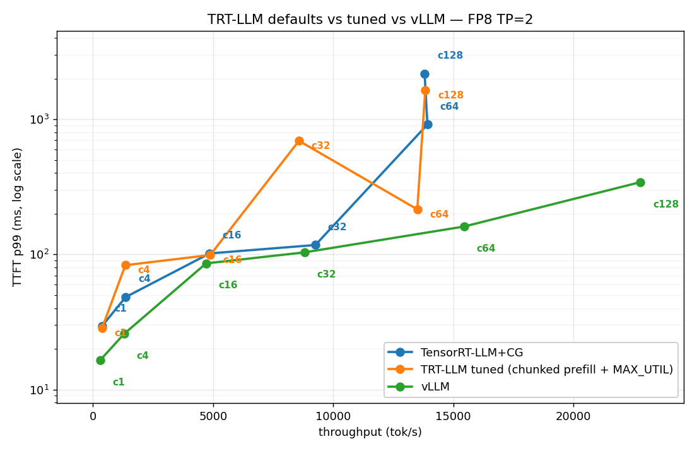
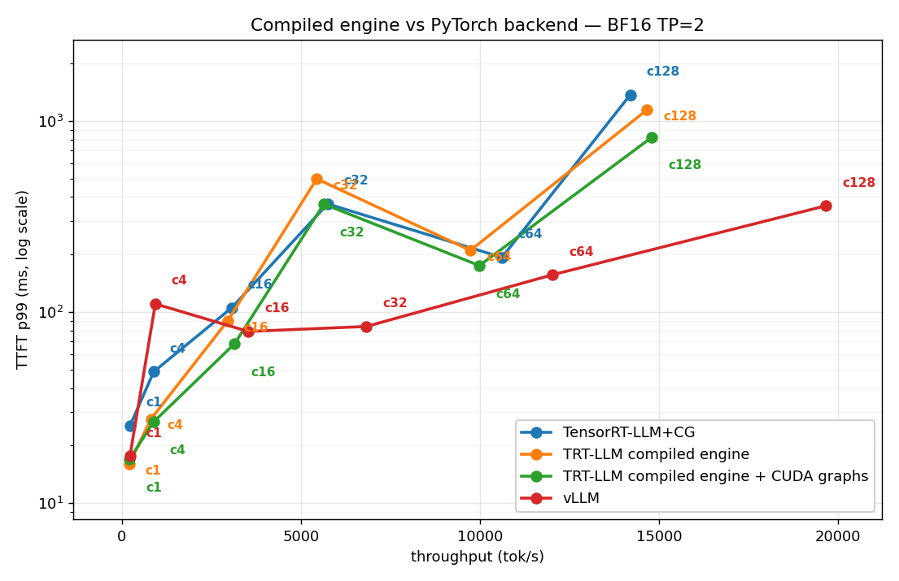
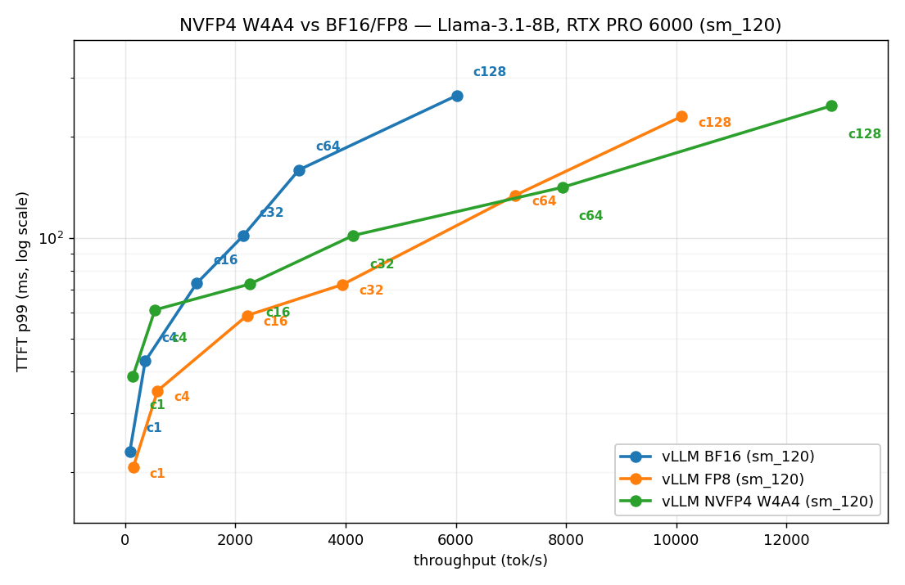

# TensorRT-LLM + Triton Multi-GPU Serving

Production-style LLM serving on the NVIDIA-native stack — **TensorRT-LLM**
tensor-parallel across **H100 (NVLink)**, benchmarked head-to-head against **vLLM**, plus
cross-model, quantization, scheduler-tuning, compiled-engine and speculative-decoding studies.
TRT-LLM is measured **three ways**: its **PyTorch backend with CUDA graphs**
(`--backend pytorch`, `pytorch_backend_config.use_cuda_graph`), a **pre-compiled TRT engine**
(`trtllm-build`, served through the same `trtllm-serve` frontend), and the engine deployed
behind **Triton's `tensorrt_llm` backend** (full ensemble model repository,
`scripts/setup_triton_repo.sh` — deployed and smoke-tested on the box).

The repo prioritizes a reproducible **serve → benchmark** loop, with a **controlled
methodology** (every request decodes exactly 256 tokens via `ignore_eos`, so
throughput/latency compare the same work across stacks).

## What this is
- A scripted pipeline: HF checkpoint → TensorRT-LLM engine (TP=4, FP8/FP16) → Triton model repository → load test.
- An apples-to-apples benchmark harness (TensorRT-LLM/Triton vs vLLM): throughput, TTFT, inter-token latency under matched concurrency.
- Documented engineering decisions: tensor parallelism, quantization, in-flight (continuous) batching, paged KV-cache.

## What this is NOT
- Not a fork of `trtllm-serve` / `genai-perf` — it wraps them in a reproducible harness with a documented comparison.
- Not a claim that TensorRT-LLM always wins — the goal is to measure honestly and explain *when and why* each stack wins.
- Not multi-node — single 4×H100 box over NVLink. Multi-node (NCCL over InfiniBand) is in the roadmap.

## Hardware
- 4× NVIDIA H100 80GB, NVLink. Tensor parallel sized per model: **TP=2** for the 8B head-to-heads,
  **TP=4** for Qwen2.5-32B.
- Driver + CUDA per the TensorRT-LLM container (see `docs/design-decisions.md`).
- **RTX PRO 6000 Blackwell Max-Q (sm_120)**, single GPU — study 10's NVFP4 W4A4 serving
  (the repo's first non-Hopper data point; environment in `results/sm120_environment.txt`).

## Layout
```
scripts/build_engine.sh     # HF -> TRT-LLM checkpoint -> engine (TP=4)
scripts/serve_triton.sh     # launch Triton with the tensorrt_llm backend
scripts/serve_vllm.sh       # vLLM baseline (TP=4) for comparison
scripts/serve_vllm_sm120.sh # vLLM on the RTX PRO 6000 (sm_120) box, TP=1 (study 10)
scripts/quantize_nvfp4.py   # Llama-3.1-8B -> NVFP4 (W4A4) checkpoint via TensorRT-Model-Optimizer
bench/bench.py              # async OpenAI-compatible load test (TTFT/throughput/ITL)
bench/sweep.sh              # concurrency sweep -> results/*.json
bench/accuracy_mc.py        # ARC-Challenge accuracy spot-check via the serving endpoint
triton_model_repo/          # Triton ensemble + tensorrt_llm model config
docs/roadmap.md             # what's done / in progress / planned
docs/design-decisions.md    # parallelism, quant, batching choices and why
results/                    # benchmark outputs + plots (populated on the 4xH100 box)
```

## Quick start (run on the 4×H100 box)
```bash
export MODEL=meta-llama/Llama-3.1-8B-Instruct   # scale up to 70B once 8B is green
make build        # build the TP=4 TensorRT-LLM engine
make serve        # start Triton on :8000
make bench        # load test -> results/trtllm.json
make bench-vllm   # same load against vLLM -> results/vllm.json
make report       # merge + plot -> results/report.md
```

## Results — measured on H100

Full writeup: [`results/report.md`](results/report.md). Plots: `pareto_fp8.png`,
`pareto_h2h.png`, `pareto_32b.png`, `pareto_models.png`. **Controlled methodology:** every
request decodes exactly 256 tokens (`ignore_eos`+`min_tokens`) on every stack/model. **Every
TRT-LLM run uses CUDA graphs**, correctly applied (see *Verification* below).

### A debugging story worth more than the table (verification spirit)

The first version of this benchmark showed TRT-LLM ~2× *slower* than vLLM everywhere — even
its FP8 engine. That's implausible for NVIDIA's own engine, so instead of publishing it I ran
a **memory-bandwidth roofline check** (`bench/roofline_check.py`): single-stream decode is
bandwidth-bound, so `tok/s_max ≈ HBM_BW × n_gpu / weight_bytes`. The TRT-LLM FP8 number was
**162 tok/s = ~19 % of roofline** — physically implausible for NVIDIA's own kernels. Root cause:
**CUDA graphs were silently OFF.** `trtllm-serve`'s `--extra_llm_api_options` maps to the LLM
API, where the key must be nested under `pytorch_backend_config.use_cuda_graph` — my first two
YAML schemas (`use_cuda_graph` flat, then 1.0's `cuda_graph_config`) were accepted but
ignored; the startup log still read `use_cuda_graph=False`. With the correct nesting the same
config jumped to **374 tok/s = ~89 % of the *single-GPU* memory-bandwidth roofline** (≈419
tok/s for 8 GB of FP8 weights against one H100's ~3.35 TB/s HBM). Because the model is split
TP=2, the *aggregate* two-GPU ceiling is ~838 tok/s, so the same 374 tok/s is **~45 % of the
TP=2 aggregate ceiling** — see *Verification* for why both denominators matter. Either way the
whole conclusion flipped. Lesson: a result that beats physics in the wrong direction is a
config bug, not a finding.

### 1. Cross-model — vLLM, TP=1, BF16 (1× H100 each)

| model | tok/s @c1 | tok/s @c128 |
|---|---|---|
| Llama-3.1-8B | 152 | 13,771 |
| Qwen3-8B | 145 | 13,411 |
| Qwen3.5-9B | 127 | 9,356 |

The 9B carries ~30 % less throughput/H100 than the 8Bs (9,356 vs 13,411/13,771 @c128) — capability-vs-cost, with numbers.
(Frontier 2026 MoE models — GLM-5.1 744B, DeepSeek-V4, Llama-4 — need the full 8-GPU box.)

**Throughput vs TTFT-p99 across the three models (TP=1, BF16): the 8Bs (blue/green) trace a tighter latency-vs-throughput frontier than the 9B (orange), which pays more TTFT for less throughput per H100:**


### 2. Head-to-head, **FP8** — Llama-3.1-8B, TP=2 (the headline)

Same model & precision (`nvidia/Llama-3.1-8B-Instruct-FP8`), TRT-LLM's **PyTorch backend + CUDA
graphs** (`--backend pytorch`, *not* a pre-compiled TRT engine — a compiled-engine comparison
is future work) vs vLLM:

| concurrency | TRT-LLM+CG tok/s | vLLM tok/s | ratio | winner |
|---|---|---|---|---|
| 1 | **374** | 300 | 1.25× | **TRT-LLM** |
| 4–32 | 1,362–9,256 | 1,291–8,809 | 1.03–1.05× | **TRT-LLM** |
| 64 | 13,919 | 15,447 | 0.90× | vLLM |
| 128 | 13,802 | 22,783 | 0.61× | vLLM |

**The split, and it only appears with CUDA graphs correctly on:** TRT-LLM wins the
**low/mid-concurrency (latency) regime** — at c1 it's 1.25× faster (374 vs 300, ITL 2.6 vs
3.0 ms) because CUDA-graph decode removes the per-step launch tax that dominates single-stream;
vLLM wins the **high-concurrency (throughput) regime** where its scheduler/batching scales
better. Enabling CUDA graphs alone took TRT-LLM from 162→374 tok/s (**2.3×**) — a direct,
independent confirmation of the [latency-wall study](../nccl-collectives-bench) in the sibling
NCCL repo (CUDA-graph capture ≈ kills the ~20 µs launch floor).

> **The "is it just the defaults?" question — asked, then answered.** These runs use
> `trtllm-serve`'s out-of-box defaults (`GUARANTEED_NO_EVICT` scheduler, chunked prefill off
> — GitHub issue #4947), and the original version of this README could only flag that as a
> caveat because published benchmarks conflict ([BentoML][bentoml] matches our result;
> [SqueezeBits][squeezebits] found tuned TRT-LLM winning at large batch). **Study 7 below
> settles it for this workload**: re-running with chunked prefill + `MAX_UTILIZATION` moves
> c128 throughput by 0.2% (it does cut TTFT p99 by 25%), and study 8 shows the compiled
> engine lands on the same ceiling. The c128 deficit is engine-runtime-level in TRT-LLM 0.20
> for this decode-heavy workload — not a configuration artifact, and not kernel quality.

**The crossover, visualized (FP8, TP=2): TRT-LLM (blue) sits left-and-lower at low concurrency (faster, lower TTFT), but its TTFT-p99 shoots up past c64 while vLLM (orange) keeps extending right to ~23k tok/s — latency winner vs throughput winner in one picture:**


### 3. Head-to-head, BF16 — Llama-3.1-8B, TP=2

| concurrency | TRT-LLM+CG | vLLM | ratio |
|---|---|---|---|
| 1 | 230 | 228 | 1.01× (tie) |
| 128 | 14,194 | 19,659 | 0.72× |

BF16 ties at c1 (FP8 is where TRT-LLM's Hopper W8A8 edge shows); vLLM pulls ahead under load.

**Same axes, BF16: the two curves overlap at low concurrency (the c1 tie) and vLLM (orange) again extends further right under load — the FP8 low-concurrency edge above is the delta this BF16 frontier is missing:**


### 4. Big model — Qwen2.5-32B, TP=4, BF16

| concurrency | TRT-LLM+CG | vLLM | ratio |
|---|---|---|---|
| 1 | 114 | 113 | 1.01× (tie) |
| 128 | 5,686 | 9,383 | 0.61× |

Same crossover shape at 32B across 4× H100 — competitive at low concurrency, vLLM ahead at
saturation. (CUDA-graph fix here too: 51→114 tok/s at c1.)

**The crossover holds at 32B on 4 cards: TRT-LLM (blue) and vLLM (orange) start together at c1, then vLLM stretches to ~9.4k tok/s while TRT-LLM saturates earlier — the same latency-vs-throughput split, scaled up to TP=4:**


### 5. Quantization — vLLM, Qwen3-8B, TP=2 (FP8 vs BF16)

FP8 ~1.27× faster at low concurrency (BF16 215 → FP8 273 tok/s @c1; memory-bandwidth-bound
decode, FP8 halves weight traffic), narrowing to ~1.12× at c128.

### 6. Frontier — n-gram (prompt-lookup) speculative decoding

Speculative decoding proposes K tokens cheaply and verifies them in one target forward pass;
accepted tokens are ~free. The **n-gram** variant needs *no draft model* — it drafts from
recent prompt n-grams, so it wins exactly when the output echoes the input (RAG, summarization,
code editing, agentic transcripts). vLLM, Qwen2.5-7B, `num_speculative_tokens=5`, **measured
non-streaming** (see why below):

| task | baseline | n-gram spec | speedup |
|---|---|---|---|
| **extractive (RAG-style, echoes context)** | 154 | **434 tok/s** | **2.82×** |
| generative (novel text) | 154 | 136 | 0.88× |

**Acceptance-gated, in one chart (batch=1, non-streaming): n-gram speculation is a 2.82× win on extractive/RAG-style output that echoes the prompt (green) and a 0.88× net loss on free-form generation (red) — n-gram drafting only helps when the output repeats the input, so the speedup follows the task, not a global switch:**


Draft acceptance **68 %**. The result is the whole point: speculative decoding is
**acceptance-gated** — a **2.8× win** where the draft is usually right, a **net loss** on
free-form generation where it isn't. An SA picks it per workload, not as a blanket switch.
- **Cross-validation**: prompt-lookup / n-gram decoding is reported at ~2–4× on input-grounded
  tasks in the literature — 2.8× lands in that band.
- **Verification caveat (again)**: streamed client-side this *looks* like 0.85× because spec
  decode emits tokens in bursts that per-SSE-chunk streaming re-serializes over the network;
  non-streaming reveals the true 2.8× — the same measurement lesson as the head-to-heads.
  (`bench/spec_decode.py`, `results/spec_decode.json`.)

### 7. Tuned-vs-tuned — is the c128 deficit just `trtllm-serve` defaults? (No.)

The follow-up the FP8 caveat demanded. Same FP8 serve command as study 2, plus the two
switches the tuning docs point at (`configs/trtllm_pytorch_tuned.yaml`):
`enable_chunked_prefill: true` + `scheduler_config.capacity_scheduler_policy: MAX_UTILIZATION`.
Key nesting verified by **introspecting the installed 0.20 wheel** (both are top-level LlmArgs
keys; putting them under `pytorch_backend_config` — as the obvious guess suggests — is
accepted and silently ignored, the same trap as the CUDA-graph config):

| concurrency | TRT defaults | TRT tuned | vLLM | TRT defaults TTFT p99 | TRT tuned TTFT p99 |
|---|---|---|---|---|---|
| 1 | 374 | 377 | 300 | 0.030s | 0.029s |
| 32 | 9,256 | 8,573 | 8,809 | 0.118s | 0.693s |
| 64 | 13,919 | 13,498 | 15,447 | 0.915s | 0.216s |
| 128 | 13,803 | **13,828** | 22,783 | 2.180s | **1.644s** |

**Throughput does not move (0.2% at c128); TTFT p99 improves 25%.** Chunked prefill does what
it promises for admission latency, but the throughput ceiling — TRT-LLM saturates at ~13.8k by
c64 while vLLM keeps scaling to 22.8k — is unchanged. Combined with study 8, the deficit is in
the engine runtime, not the scheduler defaults.



### 8. Compiled TRT engine vs PyTorch backend (+ the Triton deployment)

The other "maybe it's not a fair fight" hypothesis: all TRT-LLM numbers above use the PyTorch
backend — would the **pre-compiled engine** (`trtllm-build`) change the story?
`scripts/build_engine.sh` builds a bfloat16 TP=2 engine (~3 min for 8B); it is served through
the **same `trtllm-serve` OpenAI frontend**, so the executor is the only variable. The +CG row
adds `extended_runtime_perf_knob_config.cuda_graph_mode: true`
(`configs/trtllm_engine_cudagraph.yaml` — the C++ executor's CUDA-graph knob; the PyTorch
backend's `pytorch_backend_config` is ignored on this path):

| concurrency | PyTorch backend + CG | compiled engine | compiled engine + CG | vLLM |
|---|---|---|---|---|
| 1 | 230 | 207 | 220 | 228 |
| 32 | 5,749 | 5,443 | 5,640 | 6,831 |
| 64 | 10,614 | 9,733 | 9,985 | 12,031 |
| 128 | 14,194 | 14,663 | **14,802** | 19,659 |

**The compiled engine + CUDA graphs and the PyTorch backend land within ~6% of each other at
every concurrency** (the engine *without* CUDA graphs trails the PyTorch backend by up to ~10%
at c1) — and both trail vLLM by ~25% at c128. Two details worth quoting:
- **CUDA graphs add only ~6% to the compiled engine at c1**, versus the **2.3×** they added to
  the PyTorch backend (162→374, FP8). TRT already fuses kernels at build time; the launch-tax
  lever moves to wherever launch overhead actually lives.
- The same engine deployed behind **Triton's `tensorrt_llm` backend** (full ensemble repo:
  preprocessing → tensorrt_llm → postprocessing + BLS, `scripts/setup_triton_repo.sh`,
  TP=2 via MPI) measures **~187 tok/s at c1 through the ensemble path — ~15% below
  `trtllm-serve`** on the identical engine: the ensemble's Python pre/post-processing hop is
  not free. Production latency paths should use the BLS model or Triton's OpenAI frontend.
  (Smoke measurement at c1 only — no formal sweep JSON committed for the Triton path; the
  full-sweep numbers in the table above are from `trtllm-serve` on the same engine.)



### 9. Speculative decoding under concurrency — where does the 2.8× go?

Study 6 is batch=1. Serving is not batch=1, and speculation costs compute that stops being
free once the GPU is busy (the literature predicts a crossover: Nightjar, arXiv:2512.22420).
Measured: same extractive task, baseline vs n-gram vLLM servers run sequentially on the same
GPU, non-streaming, c1→c128 (`bench/spec_concurrency.py`):

| concurrency | baseline tok/s | n-gram tok/s | speedup | draft acceptance |
|---|---|---|---|---|
| 1 | 166 | 585 | **3.51×** | 97% |
| 4 | 643 | 1,836 | 2.86× | 99% |
| 16 | 2,476 | 6,309 | 2.55× | 98% |
| 32 | 4,690 | 9,607 | 2.05× | 97% |
| 64 | 7,572 | 10,956 | 1.45× | 98% |
| 128 | 5,868 | 6,919 | **1.18×** | 97% |

**The speedup decays monotonically (3.5× → 1.18×) while draft acceptance stays flat at ~97%.**
That flat acceptance line is the finding: the decay is *not* the draft getting worse — it is
the memory-bound → compute-bound transition. At c1 the GPU has idle compute, so verifying 5
draft tokens per step is free; at c128 every verified-then-rejected token competes with other
requests' work. No <1.0× crossover up to c128 on this task; extrapolating the decay puts
break-even near c≈256. **Deployment guidance: enable n-gram spec decode for RAG-style replicas
running below ~c32 (≥2× win); it is merely neutral by c≈128.**


### 10. NVFP4 W4A4 on RTX PRO 6000 Blackwell (sm_120) — the literature-ceiling reproduction

All numbers above are Hopper. This study adds the repo's first **sm_120** data point and tests a
published claim against our own harness (roadmap Phase 6): **NVFP4 W4A4 should deliver
~1.77–2.1× over BF16 at high concurrency, with accuracy parity** (NVIDIA NVFP4 / Jarvis Labs).

Setup: Llama-3.1-8B-Instruct → NVFP4 (W4A4) via TensorRT-Model-Optimizer PTQ
(`scripts/quantize_nvfp4.py`, 512×512-token cnn_dailymail calibration), served by **vLLM 0.18 +
flashinfer 0.6.6** on a single RTX PRO 6000 Blackwell Max-Q, against BF16 and FP8 (on-the-fly)
baselines on the same card, same serving config (`scripts/serve_vllm_sm120.sh`), same 256-token
sweep. vLLM's startup log confirms the **native FP4 path**:
`Using NvFp4LinearBackend.FLASHINFER_CUTLASS for NVFP4 GEMM` — *not* the Marlin
dequantization fallback (this is what makes the test meaningful; environment details and the
log line are committed in `results/sm120_environment.txt`).

| concurrency | BF16 tok/s | FP8 tok/s | NVFP4 tok/s | **NVFP4/BF16 (measured)** | published target |
|---|---|---|---|---|---|
| 1 | 86 | 148 | 139 | 1.61× | — |
| 4 | 364 | 588 | 541 | 1.49× | — |
| 16 | 1,298 | 2,213 | 2,257 | 1.74× | — |
| 32 | 2,140 | 3,945 | 4,139 | 1.93× | — |
| 64 | 3,154 | 7,081 | 7,938 | **2.52×** | ~1.77–2.1× |
| 128 | 6,019 | 10,096 | 12,817 | **2.13×** | ~1.77–2.1× |



**The published number reproduces — and is exceeded at high concurrency** (2.13–2.52× vs the
published ~1.77–2.1×). Reading the sweep:

- **NVFP4's win grows with concurrency** (1.61× → 2.13×): at c1 decode is weight-bandwidth-bound
  (4-bit weights ≈ FP8's win over BF16), but as the batch grows the workload turns
  compute-bound — and that is where W4A4's FP4 *Tensor Core math* (not just smaller weights)
  pulls away from FP8 (NVFP4/FP8 climbs from 0.94× at c1 to **1.27×** at c128).
- **Below c16, FP8 beats NVFP4** (0.92–0.94×). NVFP4's per-token activation quantization
  overhead isn't free; it only pays off once there is enough math to amortize it. Deployment
  guidance mirrors study 9's: **NVFP4 for throughput-oriented replicas (c≥16), FP8 for
  latency-oriented ones.**
- **Accuracy spot-check** (ARC-Challenge 300-question subset, generation-based MC through the
  same serving endpoint): BF16 **0.830**, FP8 **0.847**, NVFP4 **0.800**. The NVFP4 delta
  (−3.0 pp) is ~1.4σ for n=300 — consistent with the published "near-parity" claim
  (NVIDIA reports ≤1–2% on MMLU/GPQA-class evals), but it is a real trend, not noise-free
  parity; a full eval (not a spot-check) would be needed to pin it down.
- Caveats, stated honestly: this card is the **Max-Q (300 W)** variant and the serving stack
  runs vLLM's no-compile + decode-CUDA-graph workaround (torch.compile is broken on this
  vLLM/torch combination — `results/sm120_environment.txt`), so **absolute** tok/s are not
  comparable to the H100 studies above or to published absolute numbers; every **ratio** is
  measured under identical conditions on one card. The BF16 c64 point (3,154) is the softest
  number in the table — its ITL jumps to c128 levels; treating c128 as the high-concurrency
  read-out, the conclusion is unchanged.

### Verification & cross-validation

- **Roofline** (`bench/roofline_check.py`): all corrected c1 numbers land at **36–56 % of the
  *TP-aggregate* HBM-bandwidth ceiling** (weights split across all TP GPUs, so per-token traffic
  per GPU halves at TP=2 → the aggregate ceiling roughly doubles to ~838 tok/s for Llama-3.1-8B
  FP8) — the realistic band; nothing implausibly low (the bug was at 19 %). The two denominators
  are the same physics from different sides: the headline **374 tok/s = ~89 % of the single-GPU
  roofline (≈419 tok/s) = ~45 % of the TP=2 aggregate ceiling (≈838 tok/s)**, and 45 % sits
  inside that 36–56 % band.
- **Published data**: NVIDIA's perf-overview lists Llama-3.1-8B-FP8/H100 max throughput in the
  ~26k tok/s range (high batch) — same order as the high-concurrency numbers here. Published
  head-to-heads *conflict* on the high-concurrency winner: [BentoML][bentoml] matches this
  repo (TRT-LLM TTFT spikes past ~100 users, vLLM stays low), while [SqueezeBits][squeezebits]
  found *tuned* TRT-LLM wins at large batch sizes. **This repo resolved the conflict for its
  own workload by running the tuned config (study 7) and the compiled engine (study 8): neither
  closes the c128 gap** — for short-prompt, decode-heavy serving on TRT-LLM 0.20, the deficit
  is real and engine-level. (SqueezeBits' result used different versions and a prefill-heavier
  workload — both findings can be true; that is exactly why you measure your own workload.)

> Shared-box hygiene: all serving pinned to free GPUs (2–7) via `--gpus '"device=…"'`, never
> touching the busy GPU 0. Reproduce: `scripts/serve_vllm.sh` / `scripts/serve_trtllm.sh`
> (CUDA-graph config in `configs/trtllm_pytorch_cudagraph.yaml`), then `bash bench/sweep.sh`
> and `python bench/pareto.py` + `python bench/roofline_check.py`.

## References
- [NVIDIA/TensorRT-LLM](https://github.com/NVIDIA/TensorRT-LLM) — engine builder this harness drives.
- [triton-inference-server/tensorrtllm_backend](https://github.com/triton-inference-server/tensorrtllm_backend) — the Triton backend used here.
- [vllm-project/vllm](https://github.com/vllm-project/vllm) — the baseline compared against.
- [NVIDIA TensorRT-LLM — Tuning Max Batch Size and Max Num Tokens][trt-tune] — why the default scheduler/token-budget choices affect TTFT under load.
- [NVIDIA TensorRT-LLM — Useful Runtime Options][trt-runtime] — scheduler policy (`GUARANTEED_NO_EVICT` vs `MAX_UTILIZATION`) and chunked-prefill flags.
- [BentoML — Benchmarking LLM Inference Backends][bentoml] — independent benchmark whose high-concurrency TTFT result matches this repo's.
- [SqueezeBits — vLLM vs TensorRT-LLM (Towards Optimal Batching)][squeezebits] — controlled study where *tuned* TRT-LLM wins at large batch sizes.

[trt-tune]: https://nvidia.github.io/TensorRT-LLM/performance/performance-tuning-guide/tuning-max-batch-size-and-max-num-tokens.html
[trt-runtime]: https://nvidia.github.io/TensorRT-LLM/performance/performance-tuning-guide/useful-runtime-flags.html
[bentoml]: https://bentoml.com/blog/benchmarking-llm-inference-backends
[squeezebits]: https://blog.squeezebits.com/vllm-vs-tensorrtllm-2-towards-optimal-batching-for-llm-serving-31349

## Disclaimer
Personal project for learning and benchmarking. Views and results are my own and do not represent any employer.

## Status
**Ten measured studies complete** — studies 1–8 under a controlled 256-token methodology,
study 9 (spec decode vs concurrency) under a 200-token methodology (its speedup ratios are
internally consistent; its absolute tok/s are not directly comparable to studies 1–8), and
study 10 (NVFP4, 256-token methodology on sm_120) — with
TRT-LLM CUDA graphs correctly enabled and **every concurrency-1 number roofline-verified** (36–56% of
the TP-aggregate HBM ceiling, nothing implausible): cross-model (Llama-3.1-8B / Qwen3-8B /
Qwen3.5-9B), FP8 and BF16 head-to-heads (Llama-3.1-8B, TP=2), big-model head-to-head
(Qwen2.5-32B, TP=4), FP8/BF16 quantization (Qwen3-8B), **tuned-vs-tuned** (chunked prefill +
`MAX_UTILIZATION`), **compiled engine vs PyTorch backend** (+ Triton `tensorrt_llm`-backend
deployment, deployed and measured), batch=1 speculative decoding, **speculative decoding
under concurrency**, and **NVFP4 W4A4 serving on RTX PRO 6000 Blackwell** (the published
~1.77× over BF16 reproduced at 2.13–2.52×, native FLASHINFER_CUTLASS FP4 kernels, accuracy
spot-checked).

Headline: **TRT-LLM+CUDA-graph wins low/mid concurrency (latency) — FP8 c1 374 vs 300 tok/s;
vLLM wins high concurrency (throughput) — c128 22.8k vs 13.8k.** The high-concurrency deficit
was hypothesis-tested: it is **not** the scheduler defaults (study 7), **not** the PyTorch
backend (study 8), and **not** CUDA graphs (both paths verified on). It is engine-runtime-level
in TRT-LLM 0.20 for decode-heavy short-prompt serving. The journey — catching a silent
CUDA-graph mis-config with a physics check, then killing two plausible explanations with
controlled experiments — is the portfolio point.

Remaining (roadmap): NVIDIA perf-overview 26.4k tok/s waterfall attribution (Phase 6),
FP8 KV-cache study, genai-perf cross-check of the custom harness, draft-model (EAGLE-class)
speculative decoding, multi-node. Note: TRT-LLM 0.20's compiled-engine path supports
Llama-3.x / Qwen2.x; Qwen3 / Llama-4 run on its PyTorch backend or vLLM.
