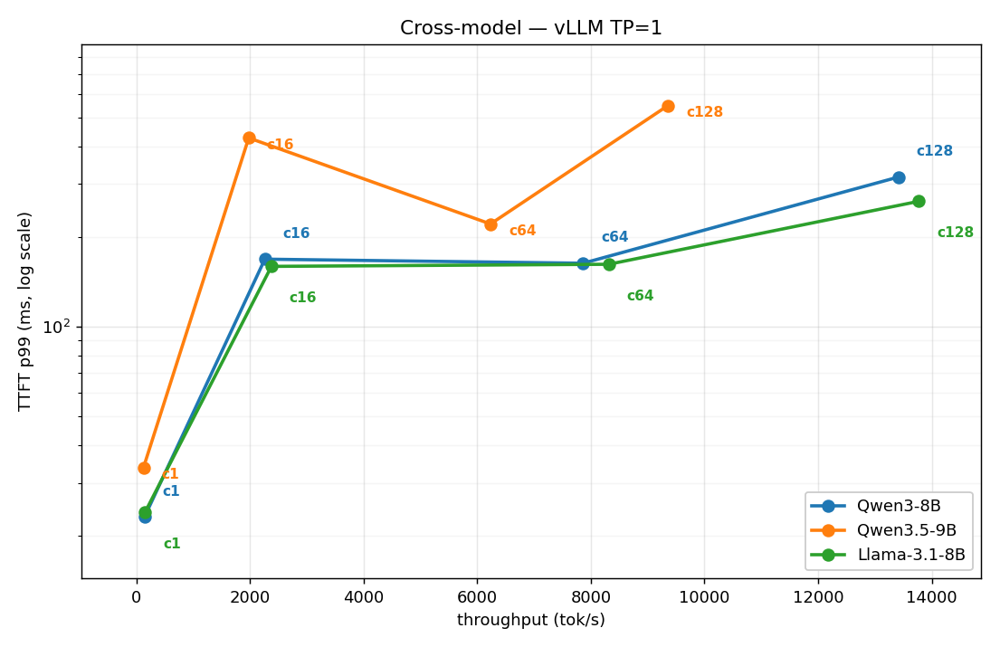
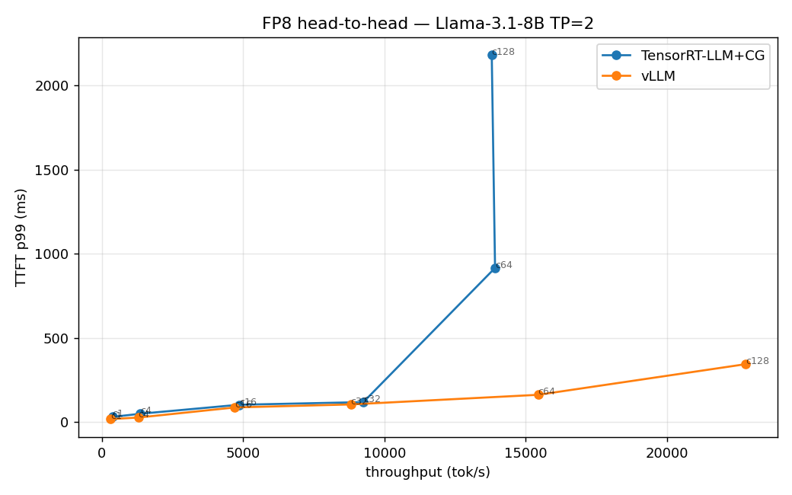
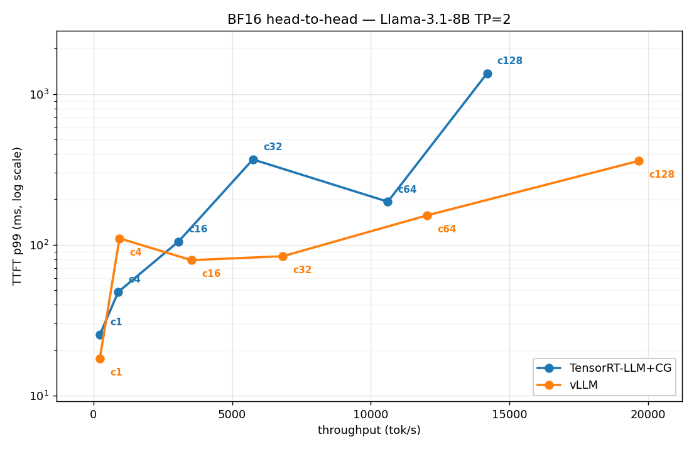
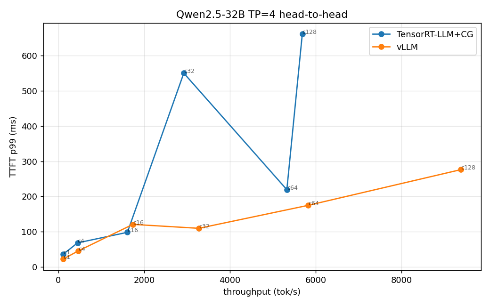
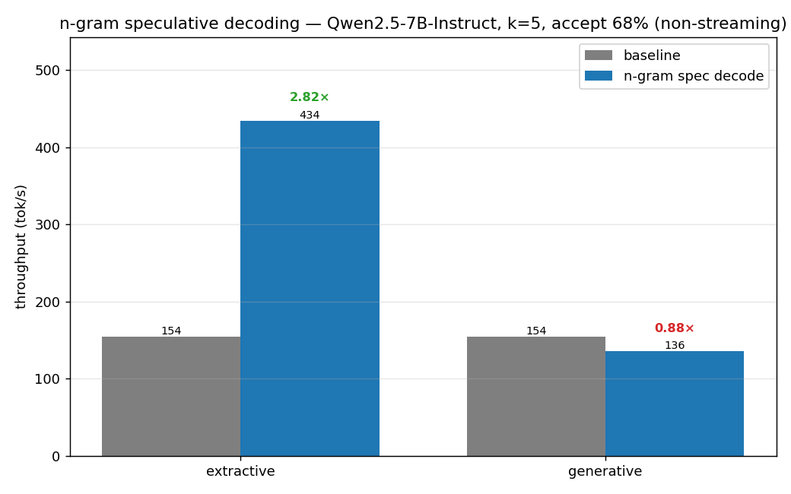

# TensorRT-LLM + Triton Multi-GPU Serving

Production-style LLM serving on the NVIDIA-native stack — **TensorRT-LLM**
tensor-parallel across **H100 (NVLink)**, benchmarked head-to-head against **vLLM**, plus a
cross-model and a quantization study. The measured TRT-LLM runs use TensorRT-LLM's own OpenAI
server (`trtllm-serve`) on its **PyTorch backend with CUDA graphs** (`--backend pytorch`,
`pytorch_backend_config.use_cuda_graph`), tensor-parallel **TP=2 for Llama-3.1-8B and TP=4 for
Qwen2.5-32B** — *not* a pre-compiled TRT engine; a compiled-engine comparison is future work
(see Status). A **Triton + `tensorrt_llm`-backend** deployment template (`triton_model_repo/`)
is included as the production path (not yet exercised in the benchmark — see Status).

The repo prioritizes a reproducible **serve → benchmark** loop, with a **controlled
methodology** (every request decodes exactly 256 tokens via `ignore_eos`, so
throughput/latency compare the same work across stacks).

## What this is
- A scripted pipeline: HF checkpoint → TensorRT-LLM engine (TP=4, FP8/FP16) → Triton model repository → load test.
- An apples-to-apples benchmark harness (TensorRT-LLM/Triton vs vLLM): throughput, TTFT, inter-token latency under matched concurrency.
- Documented engineering decisions: tensor parallelism, quantization, in-flight (continuous) batching, paged KV-cache.

## What this is NOT
- Not a fork of `trtllm-serve` / `genai-perf` — it wraps them in a reproducible harness with a documented comparison.
- Not a claim that TensorRT-LLM always wins — the goal is to measure honestly and explain *when and why* each stack wins.
- Not multi-node — single 4×H100 box over NVLink. Multi-node (NCCL over InfiniBand) is in the roadmap.

## Hardware
- 4× NVIDIA H100 80GB, NVLink. Tensor parallel sized per model: **TP=2** for the 8B head-to-heads,
  **TP=4** for Qwen2.5-32B.
- Driver + CUDA per the TensorRT-LLM container (see `docs/design-decisions.md`).

## Layout
```
scripts/build_engine.sh     # HF -> TRT-LLM checkpoint -> engine (TP=4)
scripts/serve_triton.sh     # launch Triton with the tensorrt_llm backend
scripts/serve_vllm.sh       # vLLM baseline (TP=4) for comparison
bench/bench.py              # async OpenAI-compatible load test (TTFT/throughput/ITL)
bench/sweep.sh              # concurrency sweep -> results/*.json
triton_model_repo/          # Triton ensemble + tensorrt_llm model config
docs/roadmap.md             # what's done / in progress / planned
docs/design-decisions.md    # parallelism, quant, batching choices and why
results/                    # benchmark outputs + plots (populated on the 4xH100 box)
```

## Quick start (run on the 4×H100 box)
```bash
export MODEL=meta-llama/Llama-3.1-8B-Instruct   # scale up to 70B once 8B is green
make build        # build the TP=4 TensorRT-LLM engine
make serve        # start Triton on :8000
make bench        # load test -> results/trtllm.json
make bench-vllm   # same load against vLLM -> results/vllm.json
make report       # merge + plot -> results/report.md
```

## Results — measured on H100

Full writeup: [`results/report.md`](results/report.md). Plots: `pareto_fp8.png`,
`pareto_h2h.png`, `pareto_32b.png`, `pareto_models.png`. **Controlled methodology:** every
request decodes exactly 256 tokens (`ignore_eos`+`min_tokens`) on every stack/model. **Every
TRT-LLM run uses CUDA graphs**, correctly applied (see *Verification* below).

### A debugging story worth more than the table (verification spirit)

The first version of this benchmark showed TRT-LLM ~2× *slower* than vLLM everywhere — even
its FP8 engine. That's implausible for NVIDIA's own engine, so instead of publishing it I ran
a **memory-bandwidth roofline check** (`bench/roofline_check.py`): single-stream decode is
bandwidth-bound, so `tok/s_max ≈ HBM_BW × n_gpu / weight_bytes`. The TRT-LLM FP8 number was
**162 tok/s = ~19 % of roofline** — physically implausible for NVIDIA's own kernels. Root cause:
**CUDA graphs were silently OFF.** `trtllm-serve`'s `--extra_llm_api_options` maps to the LLM
API, where the key must be nested under `pytorch_backend_config.use_cuda_graph` — my first two
YAML schemas (`use_cuda_graph` flat, then 1.0's `cuda_graph_config`) were accepted but
ignored; the startup log still read `use_cuda_graph=False`. With the correct nesting the same
config jumped to **374 tok/s = ~89 % of the *single-GPU* memory-bandwidth roofline** (≈419
tok/s for 8 GB of FP8 weights against one H100's ~3.35 TB/s HBM). Because the model is split
TP=2, the *aggregate* two-GPU ceiling is ~838 tok/s, so the same 374 tok/s is **~45 % of the
TP=2 aggregate ceiling** — see *Verification* for why both denominators matter. Either way the
whole conclusion flipped. Lesson: a result that beats physics in the wrong direction is a
config bug, not a finding.

### 1. Cross-model — vLLM, TP=1, BF16 (1× H100 each)

| model | tok/s @c1 | tok/s @c128 |
|---|---|---|
| Llama-3.1-8B | 152 | 13,771 |
| Qwen3-8B | 145 | 13,411 |
| Qwen3.5-9B | 127 | 9,356 |

The 9B carries ~25 % less throughput/H100 than the 8Bs — capability-vs-cost, with numbers.
(Frontier 2026 MoE models — GLM-5.1 744B, DeepSeek-V4, Llama-4 — need the full 8-GPU box.)

**Throughput vs TTFT-p99 across the three models (TP=1, BF16): the 8Bs (blue/green) trace a tighter latency-vs-throughput frontier than the 9B (orange), which pays more TTFT for less throughput per H100:**



### 2. Head-to-head, **FP8** — Llama-3.1-8B, TP=2 (the headline)

Same model & precision (`nvidia/Llama-3.1-8B-Instruct-FP8`), TRT-LLM's **PyTorch backend + CUDA
graphs** (`--backend pytorch`, *not* a pre-compiled TRT engine — a compiled-engine comparison
is future work) vs vLLM:

| concurrency | TRT-LLM+CG tok/s | vLLM tok/s | ratio | winner |
|---|---|---|---|---|
| 1 | **374** | 300 | 1.25× | **TRT-LLM** |
| 4–32 | 1,362–9,256 | 1,291–8,809 | 1.03–1.05× | **TRT-LLM** |
| 64 | 13,919 | 15,447 | 0.90× | vLLM |
| 128 | 13,802 | 22,783 | 0.61× | vLLM |

**The textbook split, and it only appears with CUDA graphs correctly on:** TRT-LLM wins the
**low/mid-concurrency (latency) regime** — at c1 it's 1.25× faster (374 vs 300, ITL 2.6 vs
3.0 ms) because CUDA-graph decode removes the per-step launch tax that dominates single-stream;
vLLM wins the **high-concurrency (throughput) regime** where its scheduler/batching scales
better. Enabling CUDA graphs alone took TRT-LLM from 162→374 tok/s (**2.3×**) — a direct,
independent confirmation of the [latency-wall study](../nccl-collectives-bench) in the sibling
NCCL repo (CUDA-graph capture ≈ kills the ~20 µs launch floor).

**The crossover, visualized (FP8, TP=2): TRT-LLM (blue) sits left-and-lower at low concurrency (faster, lower TTFT), but its TTFT-p99 shoots up past c64 while vLLM (orange) keeps extending right to ~23k tok/s — latency winner vs throughput winner in one picture:**



### 3. Head-to-head, BF16 — Llama-3.1-8B, TP=2

| concurrency | TRT-LLM+CG | vLLM | ratio |
|---|---|---|---|
| 1 | 230 | 228 | 1.01× (tie) |
| 128 | 14,194 | 19,659 | 0.72× |

BF16 ties at c1 (FP8 is where TRT-LLM's Hopper W8A8 edge shows); vLLM pulls ahead under load.

**Same axes, BF16: the two curves overlap at low concurrency (the c1 tie) and vLLM (orange) again extends further right under load — the FP8 low-concurrency edge above is the delta this BF16 frontier is missing:**



### 4. Big model — Qwen2.5-32B, TP=4, BF16

| concurrency | TRT-LLM+CG | vLLM | ratio |
|---|---|---|---|
| 1 | 114 | 113 | 1.01× (tie) |
| 128 | 5,686 | 9,383 | 0.61× |

Same crossover shape at 32B across 4× H100 — competitive at low concurrency, vLLM ahead at
saturation. (CUDA-graph fix here too: 51→114 tok/s at c1.)

**The crossover holds at 32B on 4 cards: TRT-LLM (blue) and vLLM (orange) start together at c1, then vLLM stretches to ~9.4k tok/s while TRT-LLM saturates earlier — the same latency-vs-throughput split, scaled up to TP=4:**



### 5. Quantization — vLLM, Qwen3-8B, TP=2 (FP8 vs BF16)

FP8 ~1.27× faster at low concurrency (BF16 215 → FP8 273 tok/s @c1; memory-bandwidth-bound
decode, FP8 halves weight traffic), narrowing to ~1.12× at c128.

### 6. Frontier — n-gram (prompt-lookup) speculative decoding

Speculative decoding proposes K tokens cheaply and verifies them in one target forward pass;
accepted tokens are ~free. The **n-gram** variant needs *no draft model* — it drafts from
recent prompt n-grams, so it wins exactly when the output echoes the input (RAG, summarization,
code editing, agentic transcripts). vLLM, Qwen2.5-7B, `num_speculative_tokens=5`, **measured
non-streaming** (see why below):

| task | baseline | n-gram spec | speedup |
|---|---|---|---|
| **extractive (RAG-style, echoes context)** | 154 | **434 tok/s** | **2.82×** |
| generative (novel text) | 154 | 136 | 0.88× |

**Acceptance-gated, in one chart (batch=1, non-streaming): n-gram speculation is a 2.82× win on extractive/RAG-style output that echoes the prompt (green) and a 0.88× net loss on free-form generation (red) — n-gram drafting only helps when the output repeats the input, so the speedup follows the task, not a global switch:**



Draft acceptance **68 %**. The result is the whole point: speculative decoding is
**acceptance-gated** — a **2.8× win** where the draft is usually right, a **net loss** on
free-form generation where it isn't. An SA picks it per workload, not as a blanket switch.
- **Cross-validation**: prompt-lookup / n-gram decoding is reported at ~2–4× on input-grounded
  tasks in the literature — 2.8× lands in that band.
- **Verification caveat (again)**: streamed client-side this *looks* like 0.85× because spec
  decode emits tokens in bursts that per-SSE-chunk streaming re-serializes over the network;
  non-streaming reveals the true 2.8× — the same measurement lesson as the head-to-heads.
  (`bench/spec_decode.py`, `results/spec_decode.json`.)

### Verification & cross-validation

- **Roofline** (`bench/roofline_check.py`): all corrected c1 numbers land at **36–56 % of the
  *TP-aggregate* HBM-bandwidth ceiling** (weights split across all TP GPUs, so per-token traffic
  per GPU halves at TP=2 → the aggregate ceiling roughly doubles to ~838 tok/s for Llama-3.1-8B
  FP8) — the realistic band; nothing implausibly low (the bug was at 19 %). The two denominators
  are the same physics from different sides: the headline **374 tok/s = ~89 % of the single-GPU
  roofline (≈419 tok/s) = ~45 % of the TP=2 aggregate ceiling (≈838 tok/s)**, and 45 % sits
  inside that 36–56 % band.
- **Published data**: NVIDIA's perf-overview lists Llama-3.1-8B-FP8/H100 max throughput in the
  ~26k tok/s range (high batch) — same order as the high-concurrency numbers here; community
  benchmarks (LMSYS, SqueezeBits) report "TRT-LLM highest, vLLM second," consistent with the
  low/high-concurrency split measured above.

> Shared-box hygiene: all serving pinned to free GPUs (2–7) via `--gpus '"device=…"'`, never
> touching the busy GPU 0. Reproduce: `scripts/serve_vllm.sh` / `scripts/serve_trtllm.sh`
> (CUDA-graph config in `configs/trtllm_pytorch_cudagraph.yaml`), then `bash bench/sweep.sh`
> and `python bench/pareto.py` + `python bench/roofline_check.py`.

## References
- [NVIDIA/TensorRT-LLM](https://github.com/NVIDIA/TensorRT-LLM) — engine builder this harness drives.
- [triton-inference-server/tensorrtllm_backend](https://github.com/triton-inference-server/tensorrtllm_backend) — the Triton backend used here.
- [vllm-project/vllm](https://github.com/vllm-project/vllm) — the baseline compared against.

## Disclaimer
Personal project for learning and benchmarking. Views and results are my own and do not represent any employer.

## Status
**Five measured studies complete**, all under a controlled 256-token methodology with TRT-LLM
CUDA graphs correctly enabled and **every number roofline-verified**: cross-model
(Llama-3.1-8B / Qwen3-8B / Qwen3.5-9B), FP8 and BF16 head-to-heads (Llama-3.1-8B, TP=2),
big-model head-to-head (Qwen2.5-32B, TP=4), and FP8/BF16 quantization (Qwen3-8B). Headline:
**TRT-LLM+CUDA-graph wins low/mid concurrency (latency), vLLM wins high concurrency
(throughput)** — and the journey there (catching a silent CUDA-graph mis-config via a physics
check) is the point. **All measured TRT-LLM runs use the PyTorch backend with CUDA graphs
(`--backend pytorch`), not a pre-compiled TRT engine.** Remaining (roadmap): a **compiled-engine
vs PyTorch-backend** head-to-head, the full Triton `tensorrt_llm`-backend (`triton_model_repo/`)
in place of `trtllm-serve`, and an FP8 KV-cache / speculative-decoding study. Note: TRT-LLM
0.20's compiled-engine path supports Llama-3.x / Qwen2.x; Qwen3 / Llama-4 run on its PyTorch
backend or vLLM.
