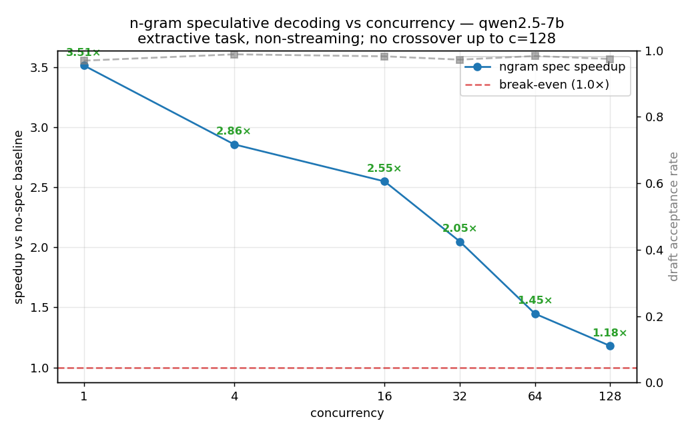

# Serving benchmark — TensorRT-LLM vs vLLM, cross-model & quantization (H100)

OpenAI-compatible servers, fixed prompt, **every request decodes exactly 256 tokens** (`ignore_eos`+`min_tokens`) so throughput/latency compare the same work. **All TRT-LLM runs use CUDA graphs**, correctly applied via `extra_llm_api_options` (`pytorch_backend_config.use_cuda_graph: true`) — see the verification note in the README for how a silent mis-config (CUDA graphs *off*) was caught with a memory-bandwidth roofline check and fixed (it had made TRT-LLM look ~2× slower). ITL is per-streamed-chunk (≈ per token).

## 1. Cross-model — vLLM, TP=1, BF16 (1× H100 each)

Llama-3.1-8B (2024) vs Qwen3-8B / Qwen3.5-9B (2026):

| model | c1 tok/s | c16 tok/s | c64 tok/s | c128 tok/s |
|---|---|---|---|---|
| Qwen3-8B | 145 | 2262 | 7862 | 13411 |
| Qwen3.5-9B | 127 | 1978 | 6234 | 9356 |
| Llama-3.1-8B | 152 | 2378 | 8315 | 13771 |

The 9B carries ~30% less throughput/H100 than the 8Bs (9,356 vs 13,411/13,771 @c128) — the capability-vs-cost trade, with numbers.

## 2. Head-to-head FP8 — Llama-3.1-8B, TP=2 (headline)

Same model & precision (FP8, `nvidia/Llama-3.1-8B-Instruct-FP8`), TRT-LLM's PyTorch backend + CUDA graphs (`--backend pytorch`) vs vLLM. **TRT-LLM wins the low/mid-concurrency (latency) regime; vLLM wins high concurrency (throughput).** This only appears once CUDA graphs are correctly on. The earlier caveat — that the c128 deficit might just be `trtllm-serve` defaults (`GUARANTEED_NO_EVICT` scheduler, chunked prefill off, GitHub issue #4947) — has now been **tested and rejected**: study 6 below re-runs with chunked prefill + `MAX_UTILIZATION` and the c128 throughput does not move (13.8k both ways), and study 7 shows the compiled engine lands in the same place. The gap at high concurrency is engine-runtime-level in TRT-LLM 0.20 for this decode-heavy workload, not a configuration artifact. (Published comparisons vary — SqueezeBits found tuned TRT-LLM winning at large batch on older versions/different workloads; BentoML found TTFT collapse at 100 users — which is exactly why this repo measures rather than quotes.)

**TensorRT-LLM+CG** (`trtllm_llama31_fp8`)

| concurrency | throughput_tok_s | ttft_p50_s | ttft_p99_s | itl_p50_ms | itl_p99_ms |
|---|---|---|---|---|---|
| 1 | 374.3 | 0.0241 | 0.0295 | 2.56 | 2.56 |
| 4 | 1361.5 | 0.0425 | 0.0484 | 2.77 | 2.8 |
| 16 | 4855.9 | 0.0573 | 0.1018 | 3.04 | 3.05 |
| 32 | 9256.2 | 0.0854 | 0.1175 | 3.09 | 3.23 |
| 64 | 13919.3 | 0.1527 | 0.9153 | 3.59 | 4.88 |
| 128 | 13802.5 | 0.2848 | 2.1801 | 7.82 | 9.25 |

**vLLM** (`vllm_llama31_fp8`)

| concurrency | throughput_tok_s | ttft_p50_s | ttft_p99_s | itl_p50_ms | itl_p99_ms |
|---|---|---|---|---|---|
| 1 | 299.6 | 0.0151 | 0.0165 | 2.98 | 2.99 |
| 4 | 1290.9 | 0.0215 | 0.0258 | 3.01 | 3.03 |
| 16 | 4707.5 | 0.041 | 0.0859 | 3.16 | 3.53 |
| 32 | 8808.9 | 0.0718 | 0.1037 | 3.33 | 3.45 |
| 64 | 15447.1 | 0.099 | 0.161 | 3.69 | 3.96 |
| 128 | 22782.6 | 0.213 | 0.3429 | 4.67 | 4.95 |

| concurrency | TRT-LLM+CG tok/s | vLLM tok/s | ratio | winner |
|---|---|---|---|---|
| 1 | 374 | 300 | 1.25× | TRT-LLM |
| 4 | 1362 | 1291 | 1.05× | TRT-LLM |
| 16 | 4856 | 4708 | 1.03× | TRT-LLM |
| 32 | 9256 | 8809 | 1.05× | TRT-LLM |
| 64 | 13919 | 15447 | 0.90× | vLLM |
| 128 | 13802 | 22783 | 0.61× | vLLM |

## 3. Head-to-head BF16 — Llama-3.1-8B, TP=2

Same as above, BF16. The two are ~tied at concurrency 1; vLLM's scheduler pulls ahead as the batch grows.

**TensorRT-LLM+CG** (`trtllm_llama31`)

| concurrency | throughput_tok_s | ttft_p50_s | ttft_p99_s | itl_p50_ms | itl_p99_ms |
|---|---|---|---|---|---|
| 1 | 230.2 | 0.0243 | 0.0254 | 4.26 | 4.27 |
| 4 | 892.8 | 0.0399 | 0.0487 | 4.33 | 4.36 |
| 16 | 3068.9 | 0.0683 | 0.1052 | 4.94 | 4.97 |
| 32 | 5748.5 | 0.0852 | 0.3679 | 5.08 | 5.2 |
| 64 | 10613.5 | 0.1361 | 0.193 | 5.45 | 5.54 |
| 128 | 14194.1 | 0.2831 | 1.3698 | 7.88 | 8.41 |

**vLLM** (`vllm_llama31`)

| concurrency | throughput_tok_s | ttft_p50_s | ttft_p99_s | itl_p50_ms | itl_p99_ms |
|---|---|---|---|---|---|
| 1 | 227.7 | 0.0159 | 0.0176 | 4.04 | 4.04 |
| 4 | 937.0 | 0.023 | 0.1103 | 4.14 | 4.5 |
| 16 | 3529.9 | 0.046 | 0.0791 | 4.34 | 4.37 |
| 32 | 6831.4 | 0.0526 | 0.084 | 4.45 | 4.48 |
| 64 | 12031.2 | 0.1075 | 0.1567 | 4.85 | 4.93 |
| 128 | 19658.7 | 0.2104 | 0.3598 | 5.55 | 5.92 |

| concurrency | TRT-LLM+CG tok/s | vLLM tok/s | ratio | winner |
|---|---|---|---|---|
| 1 | 230 | 228 | 1.01× | tie |
| 4 | 893 | 937 | 0.95× | vLLM |
| 16 | 3069 | 3530 | 0.87× | vLLM |
| 32 | 5748 | 6831 | 0.84× | vLLM |
| 64 | 10614 | 12031 | 0.88× | vLLM |
| 128 | 14194 | 19659 | 0.72× | vLLM |

## 4. Head-to-head BF16 — Qwen2.5-32B, TP=4 (big model, 4 cards)

32B tensor-parallel across 4× H100. Same crossover shape — competitive at low concurrency, vLLM ahead at saturation.

**TensorRT-LLM+CG** (`trtllm_qwen25_32b`)

| concurrency | throughput_tok_s | ttft_p50_s | ttft_p99_s | itl_p50_ms | itl_p99_ms |
|---|---|---|---|---|---|
| 1 | 114.1 | 0.0341 | 0.0355 | 8.66 | 8.66 |
| 4 | 449.0 | 0.0501 | 0.0679 | 8.73 | 8.75 |
| 16 | 1610.2 | 0.083 | 0.0979 | 9.61 | 9.72 |
| 32 | 2924.7 | 0.1188 | 0.5506 | 10.48 | 10.62 |
| 64 | 5326.1 | 0.1634 | 0.2192 | 11.33 | 11.64 |
| 128 | 5686.3 | 0.2798 | 0.6616 | 21.24 | 22.63 |

**vLLM** (`vllm_qwen25_32b`)

| concurrency | throughput_tok_s | ttft_p50_s | ttft_p99_s | itl_p50_ms | itl_p99_ms |
|---|---|---|---|---|---|
| 1 | 113.4 | 0.0216 | 0.0218 | 8.43 | 8.44 |
| 4 | 463.4 | 0.0329 | 0.0449 | 8.48 | 8.82 |
| 16 | 1738.4 | 0.0608 | 0.1205 | 8.95 | 8.98 |
| 32 | 3275.6 | 0.0809 | 0.1093 | 9.45 | 9.51 |
| 64 | 5826.0 | 0.1166 | 0.1747 | 10.48 | 10.55 |
| 128 | 9382.9 | 0.2128 | 0.2762 | 12.72 | 12.87 |

| concurrency | TRT-LLM+CG tok/s | vLLM tok/s | ratio | winner |
|---|---|---|---|---|
| 1 | 114 | 113 | 1.01× | tie |
| 4 | 449 | 463 | 0.97× | vLLM |
| 16 | 1610 | 1738 | 0.93× | vLLM |
| 32 | 2925 | 3276 | 0.89× | vLLM |
| 64 | 5326 | 5826 | 0.91× | vLLM |
| 128 | 5686 | 9383 | 0.61× | vLLM |

## 5. Quantization — vLLM, Qwen3-8B, TP=2 (FP8 vs BF16)

| concurrency | BF16 tok/s | FP8 tok/s | FP8 speedup |
|---|---|---|---|
| 1 | 215 | 273 | 1.27× |
| 4 | 885 | 1135 | 1.28× |
| 16 | 3353 | 4321 | 1.29× |
| 32 | 6189 | 7841 | 1.27× |
| 64 | 11526 | 13792 | 1.20× |
| 128 | 18585 | 20794 | 1.12× |

FP8 wins most at low concurrency (memory-bandwidth-bound decode).

## 6. Tuned-vs-tuned — does TRT-LLM's c128 deficit come from its defaults?

Same FP8 serve command as study 2, plus `enable_chunked_prefill: true` and `scheduler_config.capacity_scheduler_policy: MAX_UTILIZATION` (`configs/trtllm_pytorch_tuned.yaml`; key nesting verified against the installed 0.20 wheel — both are TOP-LEVEL LlmArgs keys, *not* `pytorch_backend_config` children as some docs suggest, which would be silently ignored).

| concurrency | TRT defaults tok/s | TRT tuned tok/s | TRT defaults TTFT p99 | TRT tuned TTFT p99 | vLLM tok/s |
|---|---|---|---|---|---|
| 1 | 374.3 | 377.0 | 0.0295s | 0.0285s | 299.6 |
| 4 | 1361.5 | 1347.8 | 0.0484s | 0.0833s | 1290.9 |
| 16 | 4855.9 | 4879.8 | 0.1018s | 0.0991s | 4707.5 |
| 32 | 9256.2 | 8572.9 | 0.1175s | 0.6934s | 8808.9 |
| 64 | 13919.3 | 13498.4 | 0.9153s | 0.2158s | 15447.1 |
| 128 | 13802.5 | 13828.0 | 2.1801s | 1.6435s | 22782.6 |

**Read-out: throughput is unchanged** (c128: 13,803 default vs 13,828 tuned — 0.2%); the c64 saturation ceiling is identical. **TTFT p99 at c128 improves 25%** (2.18s → 1.64s) — chunked prefill does what it promises for admission latency — but the throughput gap to vLLM (22.8k) is *not* a scheduler/defaults artifact. Combined with study 7 (compiled engine, same ceiling), the deficit is in the engine runtime itself for this workload on 0.20.

## 7. Compiled TRT engine vs PyTorch backend — BF16 Llama-3.1-8B TP=2

`trtllm-build` engine (bfloat16, TP=2, `--use_paged_context_fmha enable`, `scripts/build_engine.sh`) served through the same `trtllm-serve` OpenAI frontend as the PyTorch-backend runs — only the executor differs. The +CG variant adds `extended_runtime_perf_knob_config.cuda_graph_mode: true` (`configs/trtllm_engine_cudagraph.yaml`).

| concurrency | PyTorch backend + CG | compiled engine | compiled engine + CG | vLLM |
|---|---|---|---|---|
| 1 | 230 | 207 | 220 | 228 |
| 4 | 893 | 814 | 889 | 937 |
| 16 | 3069 | 2954 | 3152 | 3530 |
| 32 | 5748 | 5443 | 5640 | 6831 |
| 64 | 10614 | 9733 | 9985 | 12031 |
| 128 | 14194 | 14663 | 14802 | 19659 |

**Read-out: the compiled engine and the PyTorch backend land within ~5% of each other at every concurrency** (c1: 220 vs 230; c128: 14.8k vs 14.2k) — and both still trail vLLM by ~25% at c128. Two further observations: (1) CUDA graphs add only ~6% to the compiled engine at c1 (TRT already fuses kernels at build time) versus the 2.3× they added to the PyTorch backend (162→374 FP8) — the lever moves to wherever launch overhead lives. (2) The same engine served through the Triton `tensorrt_llm` backend's ensemble path measures ~187 tok/s at c1 (~15% below trtllm-serve) — the ensemble's Python pre/post-processing hop; see `scripts/setup_triton_repo.sh`.

## 8. Speculative decoding under concurrency — where does the benefit end?

n-gram (prompt-lookup) speculative decoding, qwen2.5-7b, extractive/RAG-style task, non-streaming (see `bench/spec_concurrency.py`). The batch=1 study showed 2.8–3.5×; this study finds where the speedup dies as concurrency rises:

| concurrency | baseline tok/s | ngram tok/s | speedup | draft acceptance |
|---|---|---|---|---|
| 1 | 166.4 | 584.5 | **3.51×** | 97% |
| 4 | 642.7 | 1835.8 | **2.86×** | 99% |
| 16 | 2475.9 | 6309.3 | **2.55×** | 98% |
| 32 | 4689.6 | 9606.5 | **2.05×** | 97% |
| 64 | 7571.5 | 10956.4 | **1.45×** | 98% |
| 128 | 5867.6 | 6919.3 | **1.18×** | 97% |

**Read-out: the speedup decays monotonically (3.5× → 1.18×) while draft acceptance stays ~97% flat** — so the decay is *not* the draft getting worse; it is the compute-bound transition predicted by the spec-decode literature (Nightjar, arXiv:2512.22420; vLLM docs): at small batch the GPU is memory-bound and verification is free, at large batch every verified-then-rejected token competes with other requests for compute. No <1.0× crossover up to c=128 on this task; extrapolating the decay puts it near c≈256. Deployment guidance: enable n-gram spec decode for RAG-style/extractive workloads when per-replica concurrency stays below ~32 (≥2× speedup); it is merely neutral by c≈128.

## 9. NVFP4 W4A4 vs BF16/FP8 — Llama-3.1-8B, vLLM TP=1, RTX PRO 6000 Blackwell (sm_120)

The repo's first non-Hopper data point (roadmap Phase 6 literature-ceiling item). Llama-3.1-8B-Instruct quantized to **NVFP4 (W4A4)** with TensorRT-Model-Optimizer (`scripts/quantize_nvfp4.py`), served by vLLM on a single RTX PRO 6000 Blackwell Max-Q, vs the BF16 and FP8 (on-the-fly) baselines on the same card (`scripts/serve_vllm_sm120.sh` — compilation off / full decode CUDA graphs, the documented sm_120 workaround, identical for every precision). **Published target being tested: ~1.77-2.1x over BF16 at high concurrency** (NVIDIA NVFP4 blog / Jarvis Labs, measured on B200/RTX PRO with native FP4 kernels).

**vLLM BF16 (sm_120)** (`vllm_sm120_bf16`)

| concurrency | throughput_tok_s | ttft_p50_s | ttft_p99_s | itl_p50_ms | itl_p99_ms |
|---|---|---|---|---|---|
| 1 | 86.4 | 0.0207 | 0.0231 | 11.53 | 11.6 |
| 4 | 363.7 | 0.04 | 0.0429 | 10.89 | 10.96 |
| 16 | 1297.9 | 0.059 | 0.0732 | 12.12 | 12.21 |
| 32 | 2139.8 | 0.0814 | 0.1014 | 14.7 | 14.85 |
| 64 | 3154.1 | 0.1299 | 0.1596 | 19.82 | 19.95 |
| 128 | 6018.9 | 0.2046 | 0.266 | 20.52 | 20.8 |

**vLLM FP8 (sm_120)** (`vllm_sm120_fp8`)

| concurrency | throughput_tok_s | ttft_p50_s | ttft_p99_s | itl_p50_ms | itl_p99_ms |
|---|---|---|---|---|---|
| 1 | 147.6 | 0.02 | 0.0207 | 6.69 | 6.69 |
| 4 | 587.7 | 0.0262 | 0.035 | 6.72 | 6.75 |
| 16 | 2212.6 | 0.0467 | 0.0587 | 7.07 | 7.1 |
| 32 | 3945.3 | 0.0635 | 0.0726 | 7.88 | 7.96 |
| 64 | 7081.2 | 0.1094 | 0.1341 | 8.6 | 8.75 |
| 128 | 10095.9 | 0.1646 | 0.2302 | 12.0 | 12.26 |

**vLLM NVFP4 W4A4 (sm_120)** (`vllm_sm120_nvfp4`)

| concurrency | throughput_tok_s | ttft_p50_s | ttft_p99_s | itl_p50_ms | itl_p99_ms |
|---|---|---|---|---|---|
| 1 | 138.9 | 0.0341 | 0.0386 | 7.06 | 7.07 |
| 4 | 540.7 | 0.051 | 0.061 | 7.26 | 7.26 |
| 16 | 2257.1 | 0.0532 | 0.0728 | 6.87 | 6.95 |
| 32 | 4138.9 | 0.0789 | 0.1017 | 7.44 | 7.57 |
| 64 | 7938.5 | 0.1127 | 0.1416 | 7.64 | 7.77 |
| 128 | 12816.8 | 0.1806 | 0.2478 | 9.26 | 9.51 |

| concurrency | BF16 tok/s | FP8 tok/s | NVFP4 tok/s | NVFP4/BF16 | published NVFP4/BF16 |
|---|---|---|---|---|---|
| 1 | 86 | 148 | 139 | **1.61x** | ~1.77x |
| 4 | 364 | 588 | 541 | **1.49x** | ~1.77x |
| 16 | 1298 | 2213 | 2257 | **1.74x** | ~1.77x |
| 32 | 2140 | 3945 | 4139 | **1.93x** | ~1.77x |
| 64 | 3154 | 7081 | 7938 | **2.52x** | ~1.77x |
| 128 | 6019 | 10096 | 12817 | **2.13x** | ~1.77x |

**Accuracy spot-check** (ARC-Challenge subset, generation-based MC via the serving endpoint — only the delta between precisions is meaningful):

| precision | ARC-Challenge accuracy | n | delta vs BF16 |
|---|---|---|---|
| vLLM BF16 (sm_120) | 0.8300 | 300 | — |
| vLLM FP8 (sm_120) | 0.8467 | 300 | +0.0167 |
| vLLM NVFP4 W4A4 (sm_120) | 0.8000 | 300 | -0.0300 |

## 10. Triton ensemble path under concurrency — where the Python hop stops being free

The same compiled BF16 engine as section 7, deployed behind Triton's `tensorrt_llm` backend (ensemble: preprocessing -> tensorrt_llm -> postprocessing, `scripts/setup_triton_repo.sh`), swept c1->c128 with `bench/bench_triton.py` (Triton generate_stream protocol, same forced-256-token methodology as every other sweep). Baselines: the same engine through `trtllm-serve` (section 7).

| concurrency | Triton ensemble | trtllm-serve (no CG) | trtllm-serve + CG | ensemble vs no-CG serve |
|---|---|---|---|---|
| 1 | 206 | 207 | 220 | -0.6% |
| 4 | 807 | 814 | 889 | -0.8% |
| 16 | 2,951 | 2,954 | 3,152 | -0.1% |
| 32 | 5,450 | 5,443 | 5,640 | +0.1% |
| 64 | 8,710 | 9,733 | 9,985 | -10.5% |
| 128 | 5,769 | 14,663 | 14,802 | -60.7% |

**Read-out: the ensemble's Python pre/post hop is FREE until c32 (0±1% vs the identical executor through trtllm-serve), then becomes THE bottleneck** — at c64 it costs ~10%, and at c128 the ensemble *regresses in absolute terms* (its throughput falls while the engine underneath keeps scaling) with TTFT p99 exploding to ~6 s while ITL stays <9 ms: requests queue at the single-instance Python preprocessing stage (`preprocessing_instance_count: 1`), not in the engine. This also revises study 8's c1 smoke estimate: against the same executor without CUDA graphs, the c1 ensemble overhead is ~0%, not ~15% — the 15% was mostly trtllm-serve's CUDA-graph advantage, which the C++ tensorrt_llm backend doesn't have.

